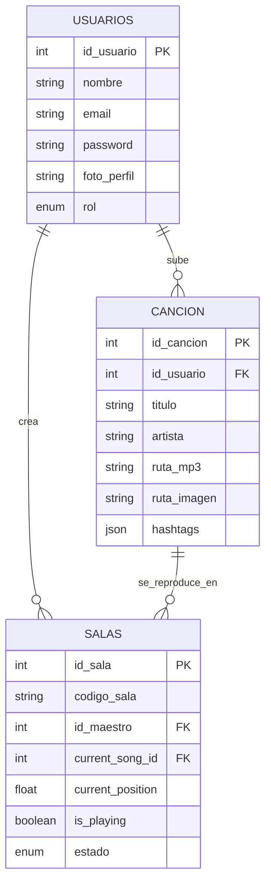

# Database Schema (Rechord)

```mermaid
erDiagram
    USUARIOS {
        int id_usuario PK
        string nombre
        string email
        string password
        string foto_perfil
        enum rol
    }

    CANCION {
        int id_cancion PK
        int id_usuario FK
        string titulo
        string artista
        string ruta_mp3
        string ruta_imagen
        json hashtags
    }

    SALAS {
        int id_sala PK
        string codigo_sala
        int id_maestro FK
        int current_song_id FK
        float current_position
        boolean is_playing
        enum estado
    }

    USUARIOS ||--o{ CANCION : sube
    USUARIOS ||--o{ SALAS : crea
    CANCION ||--o{ SALAS : se_reproduce_en
```
