# Database Design

## Entity Relationship Diagram

```mermaid
erDiagram
    %% CORE TABLES
    USUARIO {
        int id_usuario PK
        string nombre
        string email
        string password_hash
        datetime fecha_registro
        string bio
    }

    CANCION {
        int id_cancion PK
        int id_usuario FK
        string titulo
        string artista
        string nivel
        string archivo_mp3
        datetime fecha_creacion
    }

    ESTROFA {
        int id_estrofa PK
        int id_cancion FK
        string texto
        int orden
        decimal tiempo_inicio_segundos "Tiempo de inicio para sincronización"
    }

    %% ACORDES Y DIGITACIÓN (MODIFICADA: color_hex añadido)
    ACORDE {
        int id_acorde PK
        string nombre
        string descripcion
        varchar color_hex "Color de visualización en el editor"
    }

    ACORDE_DIGITACION {
        int id_digitacion PK
        int id_acorde FK
        int cuerda_6
        int cuerda_5
        int cuerda_4
        int cuerda_3
        int cuerda_2
        int cuerda_1
        int traste_inicial
    }

    ACORDE_CEJILLA {
        int id_cejilla PK
        int id_acorde FK
        int traste
        int cuerda_inicio
        int cuerda_fin
    }

    %% NEW: CONFIGURACION TEMPORAL (Métrica y Tempo)
    CONFIGURACION_TEMPORAL {
        int id_cancion PK "ID de la Canción (FK)"
        int tempo_bpm "BPM"
        int metrica_numerador "Pulso superior (ej. 4)"
        int metrica_denominador "Pulso inferior (ej. 4)"
        decimal beat_marker_inicio "Primer Beat Marker (segundos)"
    }

    %% NEW: PATRONES DE RASGUEO
    PATRON_RASGUEO {
        int id_patron PK
        int id_usuario FK
        string nombre
        json patron_data "Secuencia de golpes (down/up)"
        int duracion_pulsos "Duración en pulsos"
    }

    %% NEW: SINCRONIZACIÓN DE ACORDES Y RASGUEOS (Sustituyen a ESTROFA_ACORDE)
    ACORDE_SINCRONIZADO {
        int id_sincronia_acorde PK
        int id_cancion FK
        int id_acorde FK
        decimal tiempo_inicio "Inicio del bloque (segundos)"
        decimal tiempo_fin "Fin del bloque (segundos)"
    }

    RASGUEO_SINCRONIZADO {
        int id_sincronia_rasgueo PK
        int id_cancion FK
        int id_patron FK
        decimal tiempo_inicio "Inicio del bloque (segundos)"
        decimal tiempo_fin "Fin del bloque (segundos)"
    }

    %% COMMUNITY AND ORGANISATION TABLES
    CARPETA {
        int id_carpeta PK
        int id_usuario FK
        string nombre
    }

    CANCION_CARPETA {
        int id_cancion_carpeta PK
        int id_carpeta FK
        int id_cancion FK
    }

    LIKE_CANCION {
        int id_like PK
        int id_usuario FK
        int id_cancion FK
    }

    SEGUIR_USUARIO {
        int id_seguir PK
        int id_usuario_seguidor FK
        int id_usuario_seguido FK
    }

    %% RELACIONES
    USUARIO ||--o{ CANCION : "crea"
    USUARIO ||--o{ CARPETA : "tiene"
    USUARIO ||--o{ LIKE_CANCION : "da like"
    USUARIO ||--o{ SEGUIR_USUARIO : "sigue"
    USUARIO ||--o{ PATRON_RASGUEO : "crea"

    CANCION ||--o{ ESTROFA : "tiene"
    CANCION ||--o{ LIKE_CANCION : "recibe"
    CANCION ||--o{ CANCION_CARPETA : "pertenece a"
    CANCION ||--|{ CONFIGURACION_TEMPORAL : "tiene (1:1)"
    CANCION ||--o{ ACORDE_SINCRONIZADO : "tiene"
    CANCION ||--o{ RASGUEO_SINCRONIZADO : "tiene"

    ACORDE ||--o{ ACORDE_DIGITACION : "tiene"
    ACORDE ||--o{ ACORDE_CEJILLA : "tiene"
    ACORDE ||--o{ ACORDE_SINCRONIZADO : "es usado en"
    PATRON_RASGUEO ||--o{ RASGUEO_SINCRONIZADO : "es usado en"

    CARPETA ||--o{ CANCION_CARPETA : "contiene"
```

## Schema Notes

### Implementation Details
*   **Passwords**: The `USUARIO` table uses `password_hash` to store securely hashed passwords (e.g., using `password_hash()` in PHP), replacing the insecure `contraseña` field.
*   **File Storage**: Binary files like MP3s and Images should **NOT** be stored directly in the database. Instead, store them in the server's filesystem (e.g., `uploads/music/`, `uploads/images/`) and save the relative file path in the database columns (e.g., `archivo_mp3` in `CANCION`).
*   **Additional Tables**:
    *   `LIKE_CARPETA`: This table exists in the implementation to support liking folders, although it may not be in the high-level diagram. It links `id_usuario` and `id_carpeta`.

