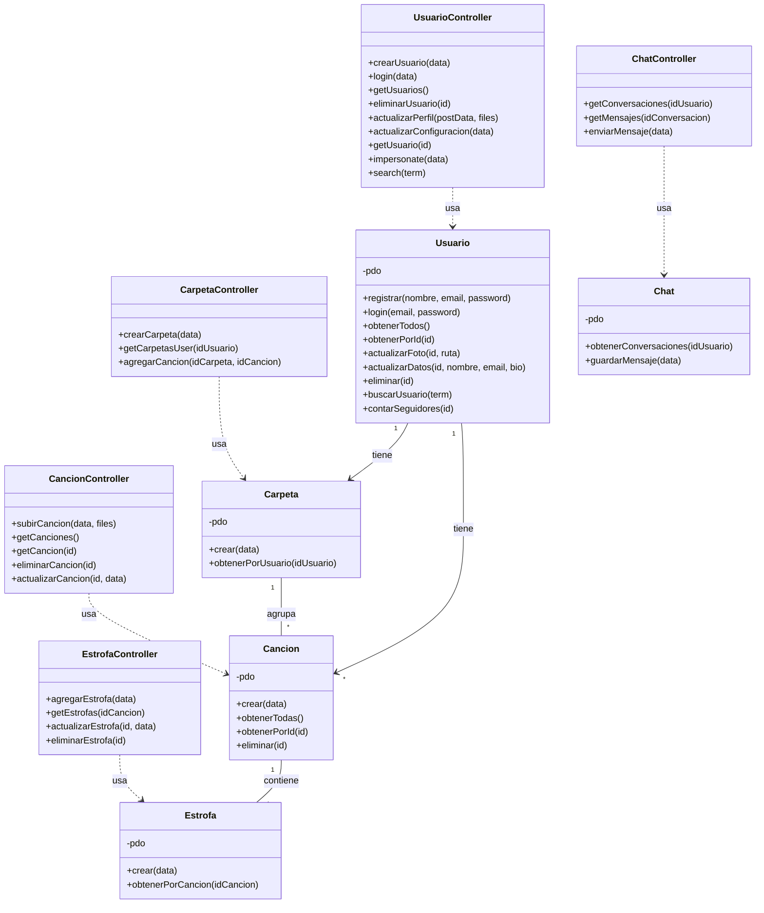

# Diagramas UML

## 1. Diagrama de Clases (Backend)

Representación de la arquitectura MVC del backend, mostrando la relación entre Controladores y Modelos.

## 2. Diagrama de Base de Datos (ER)

Esquema relacional completo de la base de datos `rechord`, excluyendo tablas de diccionario de acordes.

```mermaid
erDiagram
    USUARIO ||--o{ CANCION : "Sube"
    USUARIO ||--o{ CARPETA : "Crea"
    USUARIO ||--o{ LIKE_CANCION : "Da Like"
    USUARIO ||--o{ LIKE_CARPETA : "Da Like"
    USUARIO ||--o{ SEGUIR_USUARIO : "Sigue (seguidor)"
    USUARIO ||--o{ SEGUIR_USUARIO : "Es seguido"
    USUARIO ||--o{ NOTIFICACIONES : "Recibe"
    USUARIO ||--o{ CHAT_PARTICIPANTES : "Participa"
    USUARIO ||--o{ CHAT_MENSAJES : "Envía"
    USUARIO ||--o{ SALAS : "Crea/Maestro"
    USUARIO ||--o{ PATRON_RASGUEO : "Crea"

    CANCION ||--o{ ESTROFA : "Contiene"
    CANCION ||--o{ LIKE_CANCION : "Recibe Like"
    CANCION ||--o{ CANCION_CARPETA : "Incluida en"
    CANCION ||--o| CONFIGURACION_TEMPORAL : "Tiene"
    CANCION ||--o{ RASGUEO_SINCRONIZADO : "Tiene"

    CARPETA ||--o{ CANCION_CARPETA : "Contiene"
    CARPETA ||--o{ LIKE_CARPETA : "Recibe Like"

    CHAT_CONVERSACIONES ||--o{ CHAT_MENSAJES : "Contiene"
    CHAT_CONVERSACIONES ||--o{ CHAT_PARTICIPANTES : "Tiene"

    %% Definición de Tablas
    USUARIO {
        int id_usuario PK
        string nombre
        string email
        string password_hash
        string rol
    }

    CANCION {
        int id_cancion PK
        int id_usuario FK
        string titulo
        string artista
        string ruta_mp3
    }

    ESTROFA {
        int id_estrofa PK
        int id_cancion FK
        text texto
        float tiempo_inicio
    }

    CARPETA {
        int id_carpeta PK
        int id_usuario FK
        string nombre
    }

    CANCION_CARPETA {
        int id_cancion_carpeta PK
        int id_carpeta FK
        int id_cancion FK
    }

    LIKE_CANCION {
        int id_like PK
        int id_usuario FK
        int id_cancion FK
    }
    
    LIKE_CARPETA {
        int id_like_carpeta PK
        int id_usuario FK
        int id_carpeta FK
    }

    SEGUIR_USUARIO {
        int id_seguir PK
        int id_usuario_seguidor FK
        int id_usuario_seguido FK
    }

    NOTIFICACIONES {
        int id_notificacion PK
        int id_usuario FK
        text mensaje
    }

    CHAT_CONVERSACIONES {
        int id_conversacion PK
        timestamp fecha_ultima_actividad
    }

    CHAT_MENSAJES {
        int id_mensaje PK
        int id_conversacion FK
        int id_usuario_emisor FK
        text contenido
    }

    CHAT_PARTICIPANTES {
        int id_participante PK
        int id_conversacion FK
        int id_usuario FK
    }

    SALAS {
        int id_sala PK
        string codigo_sala
        int id_maestro FK
        enum estado
    }

    HERO_VIDEOS {
        int id_hero PK
        string titulo
        string ruta_video
        boolean activo
    }

    HOME_CONFIG {
        int id_config PK
        string tipo
        string valor
        string titulo_mostrar
    }

    CONFIGURACION_TEMPORAL {
        int id_cancion PK, FK
        int tempo_bpm
        int metrica_numerador
    }

    PATRON_RASGUEO {
        int id_patron PK
        int id_usuario FK
        string nombre
        json patron_data
    }

    RASGUEO_SINCRONIZADO {
        int id_sincronia_rasgueo PK
        int id_cancion FK
        int id_patron FK
        float tiempo_inicio
    }
```

