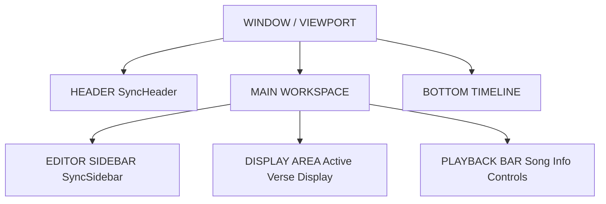
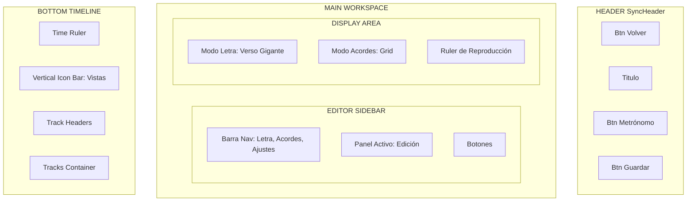
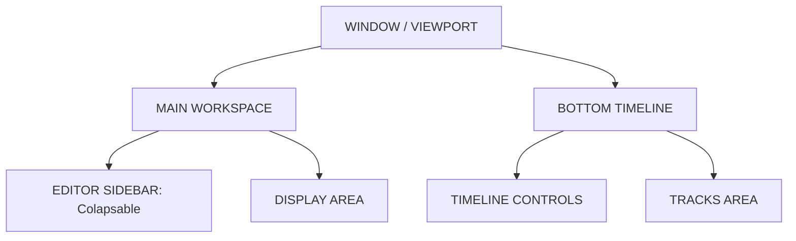
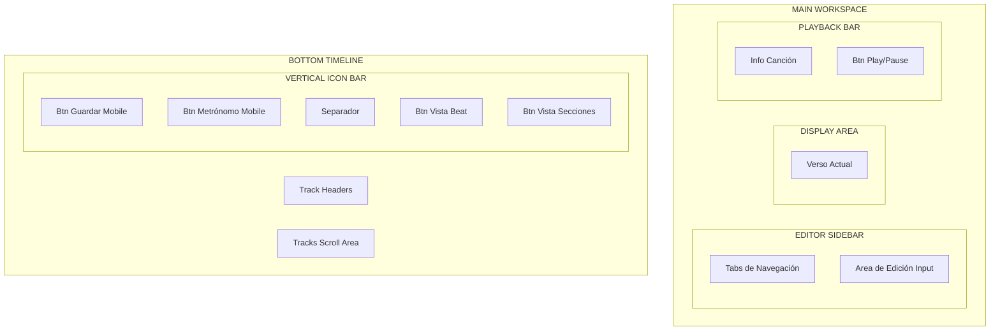

# Mapa de UI del Sincronizador

Este documento sirve como referencia visual para nombrar los elementos de la interfaz.

## 1. Vista de Escritorio (PC/Tablet)

### Nivel Superior (High Level)

### Nivel Detallado (Detailed)

---

## 2. Vista Móvil (< 820px)

### Nivel Superior (High Level)
> **Nota:** En móvil, el orden visual cambia para facilitar el flujo de trabajo:
> 1. **Editor Sidebar** (Arriba)
> 2. **Timeline** (Centro, altura reducida)
> 3. **Playback Bar / Display** (Abajo, desplegable)

### Nivel Detallado (Detailed)

## Leyenda de Términos

| Término | Descripción |
| :--- | :--- |
| **Header** | Barra superior azul oscura con botón volver y guardar (Solo PC). |
| **Editor Sidebar** | Columna izquierda donde se pega la letra, se editan acordes o se ajustan secciones. |
| **Display Area** | Zona central grande donde se ve el verso actual gigante o la lista de acordes disponibles. |
| **Playback Bar** | Barra horizontal debajo del Display con la foto de la canción y el botón Play. |
| **Timeline** | Toda la zona inferior roja/negra donde están las pistas. |
| **Vertical Icon Bar** | Barra estrecha a la izquierda del Timeline. En móvil contiene Guardar y Metrónomo. |
| **Track Headers** | Columna izquierda del timeline con los nombres (Audio, Letra, Acordes...). |
| **Tracks Area** | Zona scrolleable derecha donde aparecen los bloques de colores. |
