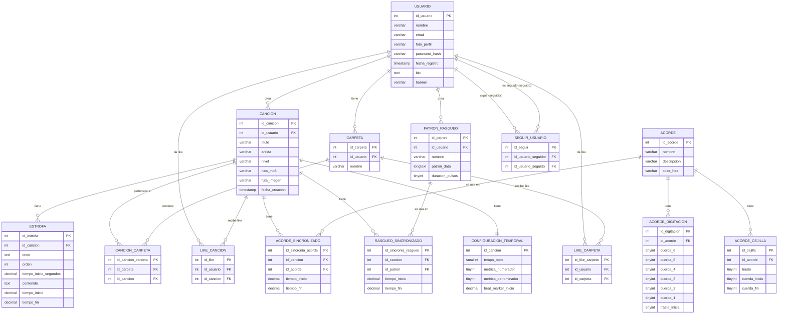

# Estructura de la Base de Datos (DB)

## Entity Relationship Diagram

```mermaid
erDiagram
    USUARIO {
        int id_usuario PK
        varchar nombre
        varchar email
        varchar foto_perfil
        varchar password_hash
        timestamp fecha_registro
        text bio
        varchar banner
    }

    CANCION {
        int id_cancion PK
        int id_usuario FK
        varchar titulo
        varchar artista
        varchar nivel
        varchar ruta_mp3
        varchar ruta_imagen
        timestamp fecha_creacion
    }

    ESTROFA {
        int id_estrofa PK
        int id_cancion FK
        text texto
        int orden
        decimal tiempo_inicio_segundos
        text contenido
        decimal tiempo_inicio
        decimal tiempo_fin
    }

    ACORDE {
        int id_acorde PK
        varchar nombre
        varchar descripcion
        varchar color_hex
    }

    ACORDE_DIGITACION {
        int id_digitacion PK
        int id_acorde FK
        tinyint cuerda_6
        tinyint cuerda_5
        tinyint cuerda_4
        tinyint cuerda_3
        tinyint cuerda_2
        tinyint cuerda_1
        tinyint traste_inicial
    }

    ACORDE_CEJILLA {
        int id_cejilla PK
        int id_acorde FK
        tinyint traste
        tinyint cuerda_inicio
        tinyint cuerda_fin
    }

    ACORDE_SINCRONIZADO {
        int id_sincronia_acorde PK
        int id_cancion FK
        int id_acorde FK
        decimal tiempo_inicio
        decimal tiempo_fin
    }

    CONFIGURACION_TEMPORAL {
        int id_cancion PK
        smallint tempo_bpm
        tinyint metrica_numerador
        tinyint metrica_denominador
        decimal beat_marker_inicio
    }

    PATRON_RASGUEO {
        int id_patron PK
        int id_usuario FK
        varchar nombre
        longtext patron_data
        tinyint duracion_pulsos
    }

    RASGUEO_SINCRONIZADO {
        int id_sincronia_rasgueo PK
        int id_cancion FK
        int id_patron FK
        decimal tiempo_inicio
        decimal tiempo_fin
    }

    CARPETA {
        int id_carpeta PK
        int id_usuario FK
        varchar nombre
    }

    CANCION_CARPETA {
        int id_cancion_carpeta PK
        int id_carpeta FK
        int id_cancion FK
    }

    LIKE_CANCION {
        int id_like PK
        int id_usuario FK
        int id_cancion FK
    }

    LIKE_CARPETA {
        int id_like_carpeta PK
        int id_usuario FK
        int id_carpeta FK
    }

    SEGUIR_USUARIO {
        int id_seguir PK
        int id_usuario_seguidor FK
        int id_usuario_seguido FK
    }

    %% Relaciones
    USUARIO ||--o{ CANCION : "crea"
    USUARIO ||--o{ CARPETA : "tiene"
    USUARIO ||--o{ LIKE_CANCION : "da like"
    USUARIO ||--o{ LIKE_CARPETA : "da like"
    USUARIO ||--o{ SEGUIR_USUARIO : "sigue (seguidor)"
    USUARIO ||--o{ SEGUIR_USUARIO : "es seguido (seguido)"
    USUARIO ||--o{ PATRON_RASGUEO : "crea"

    CANCION ||--o{ ESTROFA : "tiene"
    CANCION ||--o{ CANCION_CARPETA : "pertenece a"
    CANCION ||--o{ LIKE_CANCION : "recibe like"
    CANCION ||--o{ ACORDE_SINCRONIZADO : "tiene"
    CANCION ||--o{ RASGUEO_SINCRONIZADO : "tiene"
    CANCION ||--|| CONFIGURACION_TEMPORAL : "tiene"

    CARPETA ||--o{ CANCION_CARPETA : "contiene"
    CARPETA ||--o{ LIKE_CARPETA : "recibe like"

    ACORDE ||--o{ ACORDE_DIGITACION : "tiene"
    ACORDE ||--o{ ACORDE_CEJILLA : "tiene"
    ACORDE ||--o{ ACORDE_SINCRONIZADO : "se usa en"

    PATRON_RASGUEO ||--o{ RASGUEO_SINCRONIZADO : "se usa en"
```